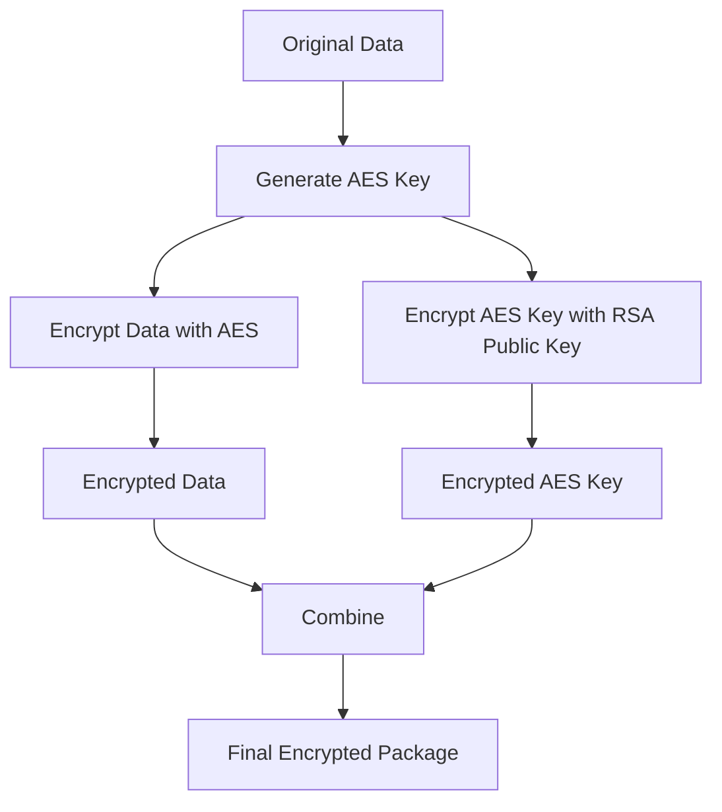
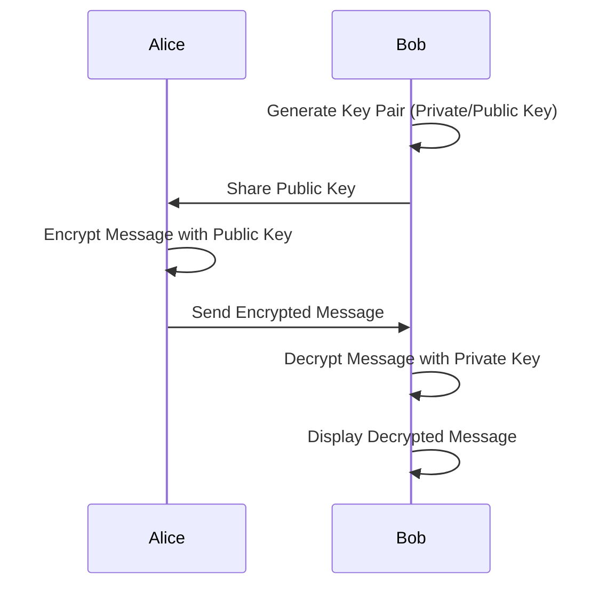

# polycrypt 🔐

Why assymetric encrypt-decrypt must be so hard?

Polycrypt is making encryption and decryption easier, one codebase for both browser and node.js (polymorphic).

## Working Principle 🧠

Polycrypt uses hybrid encryption for security and efficiency:

1. **Platform Agnostic**: 🌐 Works in browsers (`Web Crypto API`) and Node.js (`node:crypto`)

2. **Hybrid Encryption**: 🔀

   - **AES-GCM** (Symmetric): 🚀 Encrypts data quickly, no size limit
   - **RSA-OAEP** (Asymmetric): 🔒 Securely encrypts the AES key

3. **Process**: 🔄
   1. Generate random AES key
   2. Encrypt data with AES
   3. Encrypt AES key with recipient's RSA public key
   4. Combine encrypted data and key



## Installation 📦

```sh
npm install polycrypt
# or
yarn add polycrypt
```

## Usage 🚀

```javascript
import { Polycrypt } from 'polycrypt';
// or
const { Polycrypt } = require('polycrypt');

// Initialize the library
const crypto = window.crypto; // Use node:crypto for Node.js
const polycrypt = new Polycrypt(crypto);
```

### Scenario: Alice wants to send an encrypted message to Bob 💌



1. Key Generation:
   Bob generates a key pair:

   ```javascript
   const bob = await polycrypt.generateKeyPair();
   ```

2. Key Sharing:
   Bob shares his public key with Alice (through a secure channel).

3. Encryption:
   Alice encrypts her message using Bob's public key:

   ```javascript
   const message = "Hey Bob, let's meet at the secret location at 9 PM!";
   const encrypted = await polycrypt.encryptString(bob.publicKey, message);
   ```

4. Sending:
   Alice sends the encrypted message to Bob (can be through any channel).

5. Decryption:
   Bob receives the encrypted message and decrypts it using his private key:

   ```javascript
   const decrypted = await polycrypt.decryptString(bob.privateKey, encrypted);
   console.log(decrypted); // "Hey Bob, let's meet at the secret location at 9 PM!"
   ```

### JSON Encryption Example 📊

Alice wants to send Bob some structured data:

```javascript
const secretData = {
  location: 'Old Oak Tree',
  time: '21:00',
  password: 'whisper',
};
const encryptedJSON = await polycrypt.encryptJSON(bob.publicKey, secretData);

// Bob decrypts the JSON
const decryptedJSON = await polycrypt.decryptJSON(
  bob.privateKey,
  encryptedJSON,
);
console.log(decryptedJSON);
// { location: "Old Oak Tree", time: "21:00", password: "whisper" }
```

We also have `encryptString` and `decryptString` for plain text.

## Development 🛠️

To set up the project for development:

```sh
git clone https://github.com/JunyaoC/poly-encrypt-util.git
cd poly-encrypt-util
yarn install
```

⚠️ This project requires `node@20` or higher.

## Scripts 📜

```sh
yarn dev          # Run the code in development mode using swc and nodemon
yarn develop      # Run the code using ts-node/esm loader

yarn test         # Run unit tests
yarn test:watch   # Watch and run unit tests
yarn test:coverage # Run tests with coverage

yarn lint         # Lint the code
yarn lint:fix     # Lint and fix code issues

yarn prettier     # Check code formatting
yarn prettier:write # Format code

yarn type-check   # Run TypeScript type checking

yarn clean        # Remove build and dist directories
yarn build        # Build the project using swc
yarn build:watch  # Watch and build the project

yarn bundle       # Generate CJS and ESM bundles

yarn start:cjs    # Run the CJS bundle
yarn start:esm    # Run the ESM bundle

yarn release      # Run semantic-release for versioning and publishing
```

## License 📄

MIT
